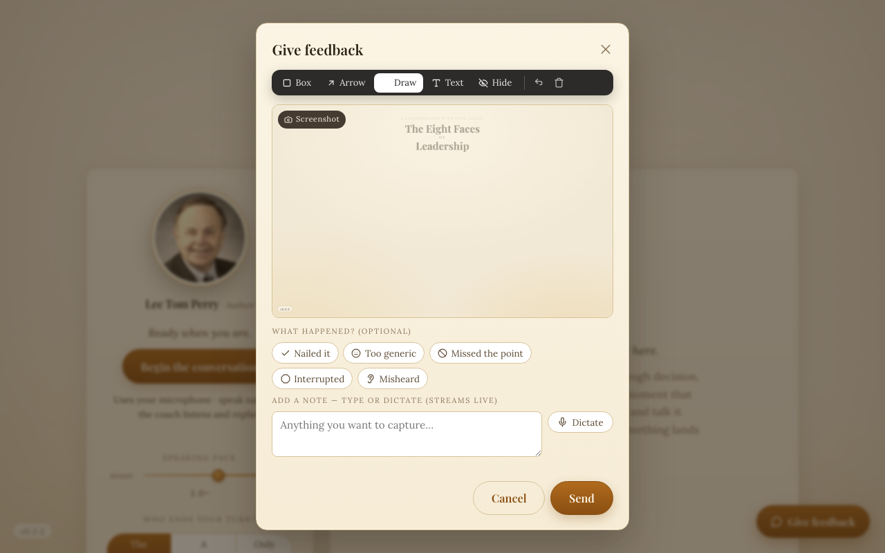
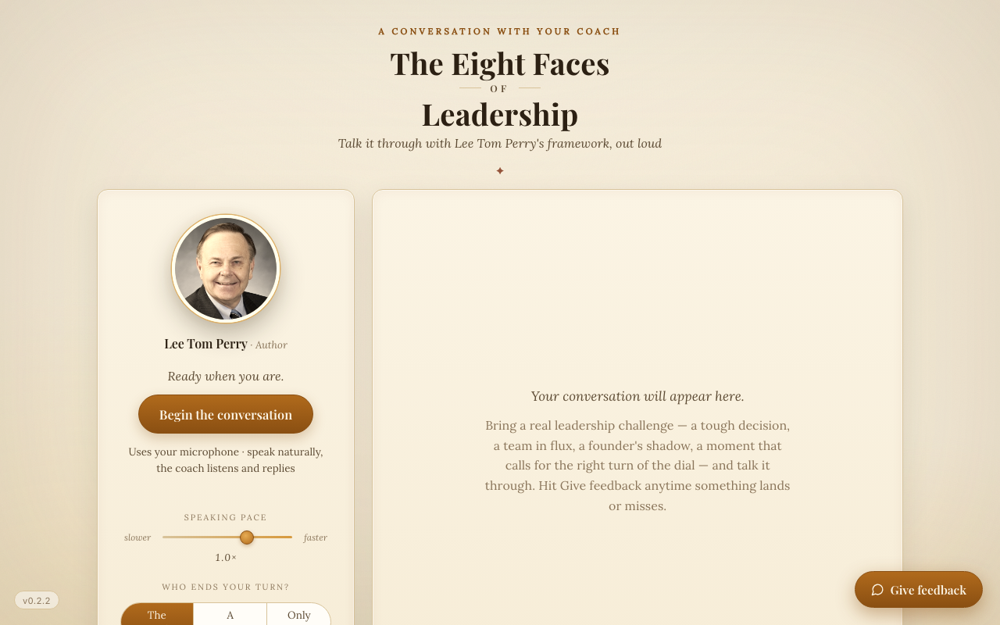

# Eight Faces, the voice adaptation

Eight Faces is a voice-first AI leadership coach (speech-to-speech, zero-build
vanilla JS). Its feedback loop is the spec adapted for a real-time medium; the
full pattern write-up is in [docs/adaptations.md](../../docs/adaptations.md).

What the modal shows, and why it differs from the page-app widget:

- **Annotation toolbar up front** (Box, Arrow, Draw, Text, Hide). Hide is the
  redaction blackout: user-driven scrubbing of on-screen PII before anything
  uploads. Annotations composite into one JPEG client-side.
- **Reason chips** ("Nailed it", "Too generic", "Missed the point",
  "Interrupted", "Misheard") instead of the bug/confusing/idea triple. In a
  coaching app the failure modes repeat, so one tap classifies the report and
  the review CLI can count them.
- **Dictate** streams the note live through the same transcription pipeline
  the coach uses.
- Behind the scenes, pressing the feedback button **freezes the session**
  (pauses the realtime audio and the recorder) so the captured moment is the
  reported moment, and the report is stamped with the session time and coach
  turn it refers to.

The close side is adapted too: instead of `/fix-bug` per report, a
`/tune-coach` command clusters a batch of reports into failure modes, maps
each to a specific lever (voice-activity eagerness, the coach prompt, the
retrieval layer), ships one change per cluster, and closes with a
`Coach-Note:` commit trailer. Because the prompt version is hashed onto every
session, the next batch measures whether the change worked.
