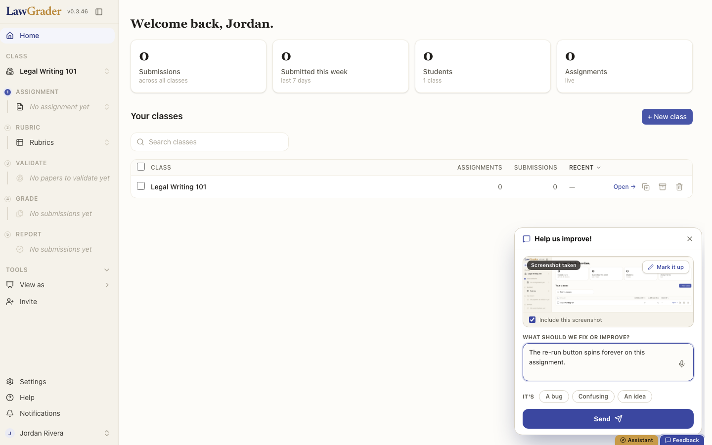
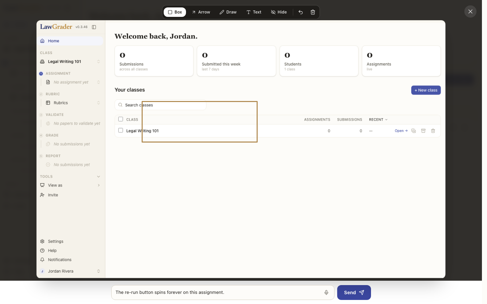
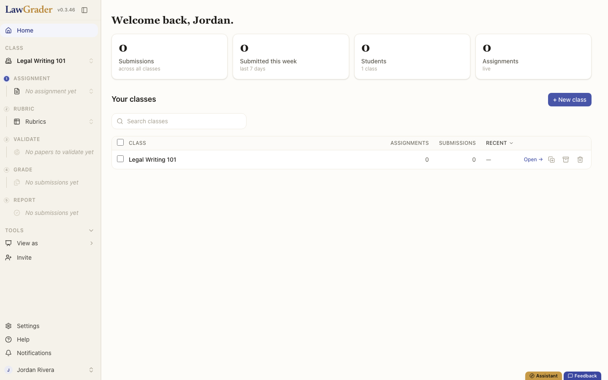

# LawGrader / WriteGrader, the canonical implementation

[LawGrader](https://lawgrader.ai) and [WriteGrader](https://new.writegrader.com)
run the loop exactly as specified: SvelteKit + Supabase, the widget in the root
layout, `bug_reports` / `bug_messages` / `bug_events`, the `/admin/bugs` inbox
with the "Open in Claude Code" handoff, the `/feedback` reporter page, and the
post-commit hook. Most of the production lessons in `SPEC.md` were learned
here, including the textarea capture trap, the `keepalive` 64KB cap, and the
storage 404-as-PNG trap.

Screenshots below were taken on a dev instance with a throwaway account and
dummy data; the UI is the production UI.

The widget, open over the teacher dashboard: auto-captured screenshot with
"Include this screenshot" on by default and a "Mark it up" affordance, one
textarea with dictation, the three-kind chip row (A bug / Confusing / An
idea), optimistic Send. Note the docked Feedback launcher in the corner,
paired with the Assistant tab on the same edge.

The annotator: box, arrow, draw, text, and Hide (redaction) over the captured
screenshot, with the note editable in place. Annotations flatten into the PNG
client-side before upload.

The surface the widget lives on. It is mounted once in the root layout, so
every page in the app, including this dashboard, can file a report with the
same three keystrokes.
